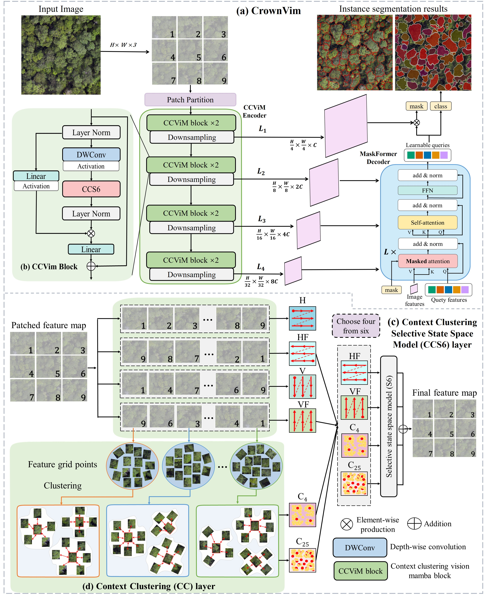

# CCViM

This repository contains the official PyTorch implementation of the following paper:

#### CrownVim: Context Clustering Meets Vision Mamba for Precise Tree Crown Segmentation in Aerial RGB Imagery

Ziyang Shi, Xuan Xiong, Lin Li,  
School of Electronic Information and Physics, Central South University of Forestry and Technology, Changsha 

## Abstract
The proliferation of high-spatial-resolution remote sensing data is transforming forest attribute estimation, replacing traditional manual approaches with deep learning-based Individual Tree Crown Delineation (ITCD). Nevertheless, accurate ITCD boundary extraction from aerial RGB imagery faces persistent challenges: boundary ambiguity from complex crown occlusion in mixed forests, scarcity of high-quality annotations, and computational limitations of existing methods in dense forests. The latter manifests particularly in overlapping crown scenarios through constrained receptive fields, leading to substantial parameter requirements, computational inefficiency, and compromised accuracy. To overcome these limitations, we propose CrownViM, a novel architecture based on a bidirectional State Space Model (SSM). The framework integrates a linear-complexity Context Clustering Vision Mamba (CCViM) encoder for efficient global context modeling and employs a MaskFormer decoder for precise boundary prediction. We further introduce a partial-supervision loss function to reduce dependence on exhaustively annotated crown masks. Evaluations on OAM-TCD and the Single-tree Segmentation Dataset (SSD) show CrownViM achieves significant segmentation accuracy improvements while maintaining a lightweight profile (39.6 M parameters). It substantially outperforms Convolutional Neural Network (CNN), Vision Transformer (ViT), and hybrid-based baselines when processing overlapping crowns and structurally complex scenes. As the first implementation of state space models in ITCD, CrownViM effectively addresses core limitations in global context capture, computational efficiency, and boundary definition. Our efficient architecture and sparse-annotation loss strategy enable high-accuracy, robust individual tree mapping, advancing tools for large-scale forest monitoring and accurate carbon stock quantification.

## The overall architecture

## Visual results on OAM-TCD dataset

## Visual results on Single-tree Segmentation dataset

